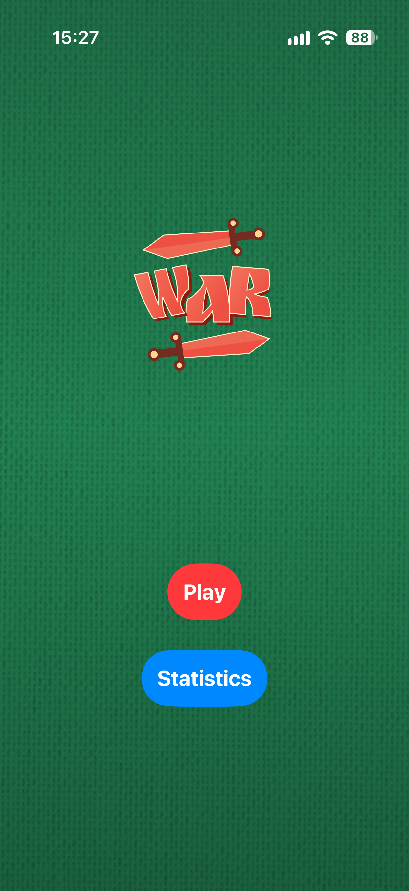
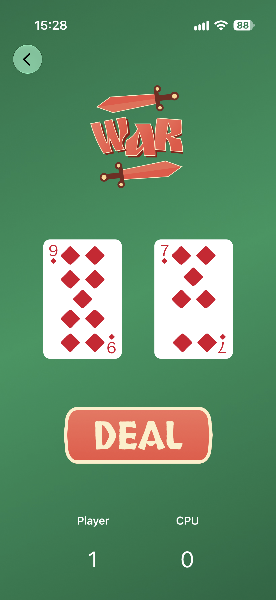
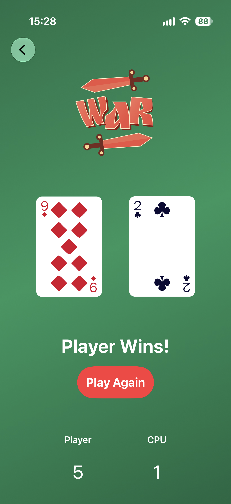
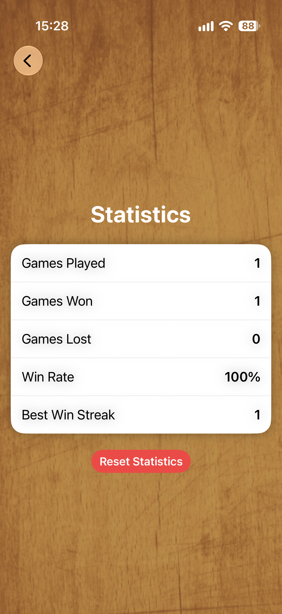

# SwiftUI War Card Game

A simple card game built with SwiftUI where the player competes against the CPU. The highest card wins each round, and the score is updated automatically.

## Features

- Random card dealing
- Automatic score tracking
- Computer opponent (CPU)
- Win and loss statistics
- Persistent win streak tracking
- Replay after a finished game
- Statistics reset
- Built entirely with SwiftUI

## Technologies

- Swift
- SwiftUI
- Xcode
- Git
- GitHub

## Screenshots

  
  
  
  

## Future Improvements

- Card dealing animations
- Sound effects

## Author

**Roni Tiftikci**

GitHub: https://github.com/Ron-tif
